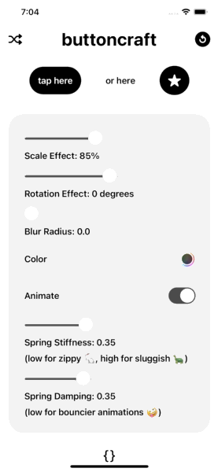
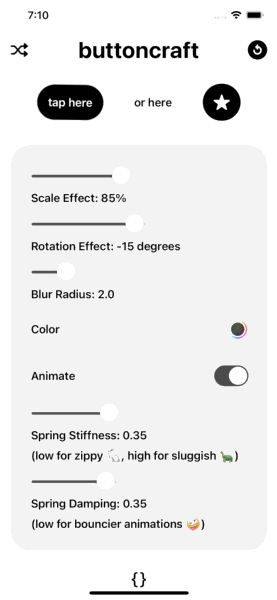
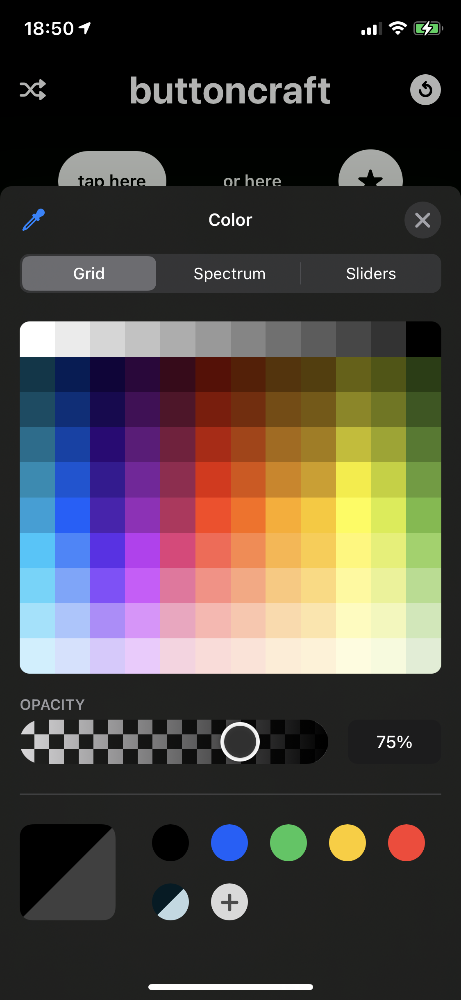

    
    
    
    

 
# buttoncraft (SwiftUI 2.0 App)
> Experimenting with `SwiftUI 2.0` whilst creating a practical app to craft that perfect button style.

 

 

### 🧐 Features

- 🔀 Randomise different settings for inspiration
- Reset to my default style
- Using the new iOS `ColorPicker`
- Copy your perfect masterpiece as a code snippet to your clipboard

### 👨🏻‍⚖️ Disclaimer

> This is posted as a way to share SwiftUI learnings (and is not production level code). Use it at your own risk.