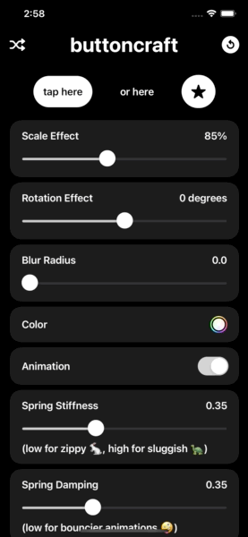

<p align="center"></p>

<p align="center">
    
    
    
    
</p>
 
# buttoncraft (SwiftUI 2.0 App)
> Experimenting with `SwiftUI 2.0` whilst creating a practical app to craft that perfect button style.

### ✈️ Testflight

https://testflight.apple.com/join/pZDhygQt

 

### 👨🏻‍💻 Code outputted from app

```Swift
struct MyButtonStyle: ButtonStyle {
    func makeBody(configuration: Self.Configuration) -> some View {
        configuration.label
            .background(Capsule()
                            .foregroundColor(configuration.isPressed ? Color.primary.opacity(0.75) : Color.primary))
            .scaleEffect(configuration.isPressed ? CGFloat(0.85) : 1.0)
            .rotationEffect(.degrees(configuration.isPressed ? 0.0 : 0))
            .blur(radius: configuration.isPressed ? CGFloat(0.0) : 0)
            .animation(Animation.spring(response: 0.35, dampingFraction: 0.35, blendDuration: 1))
    }
}

extension Button {
    func myButtonStyle() -> some View {
        self.buttonStyle(MyButtonStyle())
    }
}

// to use
Button(action: { }) {
    Text("just like that")
        .font(Font.body.bold())
        .padding()
        .foregroundColor(Color.primary)
        .colorInvert()
}
.myButtonStyle()

Button(action: { }) {
    Image(systemName: "face.smiling")
        .font(Font.body.bold())
        .imageScale(.large)
        .padding()
        .foregroundColor(Color.primary)
        .colorInvert()
}
.myButtonStyle()

```

### 🧐 Features

- 🔀 Randomise different settings for inspiration
- Reset to my default style
- Using the new iOS `ColorPicker`
- Copy your perfect masterpiece as a code snippet to your clipboard

### 👨🏻‍⚖️ Disclaimer

> This is posted as a way to share SwiftUI learnings (and is not production level code). Use it at your own risk.
